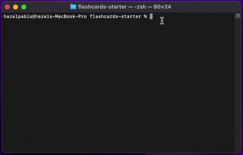

# Flash Cards

## Table of Contents
- [Overview](#Overview)
- [Setup](#Setup)
- [ScreenShots](#ScreenShots)
- [Contributors](#Contributors)
- [Technologies](#Technologies)

## Overview
This solo project created a flash card simulation that was playable through the command line. The user answers multiple choice questions and is notified whether their guess is incorrect correct after each question. This project included unit tests that tested the created complex classes.

## Setup
- Fork & Clone this repository down to your local machine
- Navigate into the flashcards directory
- Run node index.js in the terminal to interact with the application

## Screenshots

Functionality 
  

## Contributors
- [Hazel Pablo](https://github.com/Hpablo08?tab=repositories)

## Technologies
  - Javascript
  - Mocha/Chai
  - TDD
